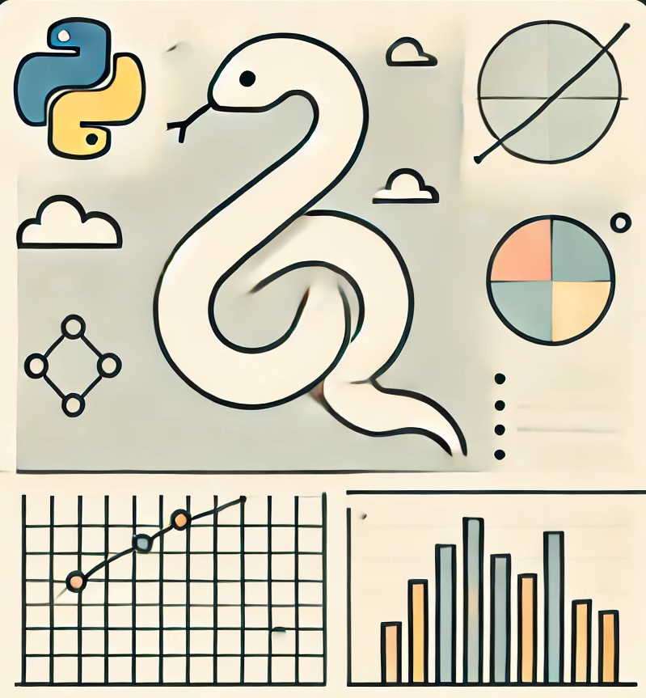

  
  <h1 style="margin-left: 10px; font-size: 43px;">Proyecto lógica  Python</h1>

Este repositorio contiene un proyecto en el que se aplican los conocimientos adquiridos en el curso de Python. Incluye una serie de ejercicios y desafíos de programación resueltos, orientados a reforzar las habilidades de codificación mediante la práctica y el perfeccionamiento de diferentes técnicas.

## Objetivos del proyecto

* Manejo de tipos de datos básicos y funciones incorporadas.
* Manejo de estructuras de datos en Python y sus métodos.
* Manejo de condicionales.
* Manejo de estructuras de iteración
* Manejo de funciones en Python.
* Manejo de Clases y entendimiento de la programación orientada a objetos.
* Uso de módulos y librerías.
* Buenas prácticas.

## Herramientas utilizadas 

* Python 3.13
* Jupyter Notebook
* Visual Studio Code

## Estructura del proyecto

### 
    Proyecto_Katas_Python
    │
    ├──README.md
    ├──resultados_Katas_Python.ipynb
    └──Img
         └──katas_pythong_portada.png

## Autor

- Victor - [GitHub Profile](https://github.com/Vic-tor123)